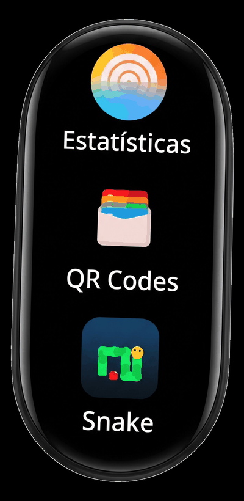

# QRWallet

<p align="center">
  
</p>

<p align="center">
  <sub><strong>VELA QUICKAPP · AMOLED · MATRIZ ÓPTICA DE HARDWARE · HYPEROS · RESPOSTA HÁPTICA</strong></sub>
</p>

<p align="center">
  🇵🇹 <strong>Português (PT)</strong>
  · <a href="README.pt-br.md">🇧🇷 Português (BR)</a>
  · <a href="README.md">🇬🇧 English</a>
  · <a href="README.es.md">🇪🇸 Español</a>
  · <a href="README.zh.md">🇨🇳 简体中文</a>
  · <a href="README.ru.md">🇷🇺 Русский</a>
</p>

> **Carteira autónoma de códigos QR e atalhos rápidos para a Xiaomi Smart Band 9 e Smart Band 10 (Xiaomi Vela / HyperOS).**  
> Acesso direto às tuas credenciais digitais essenciais (WhatsApp, Telegram, Instagram, Revolut, GitHub, IBAN, Marcador telefónico e Acesso Wi-Fi) renderizadas como códigos QR invertidos com calibração óptica para ecrãs AMOLED diretamente no teu pulso. Zero dependência de internet. Zero aplicação em segundo plano no telemóvel.

<p align="center">
  
</p>

---

## 01 / VISÃO GERAL (AT A GLANCE)

<p align="center">
  
</p>

---

## 02 / CAPACIDADES

### Destaques Arquiteturais

- **100% Autónomo no Firmware da Pulseira**: Executa nativamente no motor QuickApp do Xiaomi Vela no microcontrolador da pulseira. Nenhuma aplicação precisa de ficar aberta no telemóvel e não requer ligação de dados durante a utilização.
- **Óptica Invertida para AMOLED**: Códigos QR convencionais com fundo branco causam reflexo e encandeamento em ecrãs de pulso. O QRWallet utiliza fundo preto absoluto `#000000` com módulos brancos `#FFFFFF`, maximizando a autonomia da bateria OLED e ativando câmaras de telemóveis (Google Lens, câmara do iPhone, apps bancárias) instantaneamente.
- **Densidade Ergonómica Nativa**: Calibrado com `height: 160px` por cartão, exibindo com precisão exatamente 3 itens por ecrã no display de 490px/520px sem cortes desajeitados.
- **Glifos Vetoriais Genuínos**: Ícones de alta fidelidade em 96×96 px combinados com a tipografia nativa `MiSans` (renderizada em 24px com peso normal, sem deformação de falso negrito).
- **Confirmação Háptica**: Pulsos de microvibração ao tocar num atalho e ao deslizar para voltar.
- **Estabilidade Sem Bytecode**: Empacotado estritamente como JavaScript ES6 padrão. Evita a flag `--enable-jsc` que causa encerramentos com ecrã preto no HyperOS 2 / Band 10.

---

## 03 / ANATOMIA ÓPTICA E DE ECRÃ

<p align="center">
  
</p>

<details>
<summary><strong>Especificações Técnicas de Hardware e Matriz Óptica</strong></summary>

| Parâmetro | Especificação | Objetivo / Racional |
| :--- | :--- | :--- |
| **Dispositivos Alvo** | Xiaomi Smart Band 9 e 10 | Formato de cápsula OLED |
| **Resolução Virtual** | `192 × 490` (`designWidth: 192`) | Elimina distorções de arredondamento em ponto flutuante |
| **Ritmo da Lista** | `height: 160px` | 3 cartões visíveis por viewport (`490 / 160 ≈ 3.06`) |
| **Geometria dos Ícones** | `96 × 96 px` RGBA PNG | Dimensão padrão nativa de ficheiros gráficos |
| **Tipografia** | `MiSans`, `24px`, `font-weight: normal` | Fonte vetorial nativa do sistema; evita bordas pixelizadas |
| **Moldura do Código QR** | `184 × 184 px` (`margin: 1`) | Preenche a largura preservando a margem de segurança (*quiet zone*) |
| **Modelo de Cor** | Frente `#FFFFFF` / Fundo `#000000` | Matriz óptica de alto contraste para AMOLED |
| **Interpolação** | `NEAREST` (Vizinho mais próximo) | Módulos quadrados nítidos sem desfocagem |

</details>

---

## 04 / CUSTOMIZAÇÃO POR INTELIGÊNCIA ARTIFICIAL (PASSO 1: PERSONALIZAR E GERAR O .RPK)

> [!NOTE]  
> **Por que deves personalizar primeiro?** Nem o Notify nem o Mi Fitness possuem interface gráfica para editar dados de QuickApps no telemóvel. **Todas as tuas credenciais, links e ícones são compilados diretamente no binário `.rpk` antes da instalação.**

Para personalizares este repositório com os teus dados em poucos segundos, utiliza o ficheiro **[`AI_CUSTOMIZATION_PROMPT.md`](./AI_CUSTOMIZATION_PROMPT.md)**.

<details>
<summary><strong>Template do Prompt para IA (Copiar e Colar)</strong></summary>

Copia o bloco abaixo e envia para qualquer IA (**ChatGPT, Claude, Gemini, Antigravity, Cursor**):

```text
You are an expert developer specializing in the Xiaomi Vela QuickApp framework (for Xiaomi Smart Band 9 & 10).
I have cloned the "QRWallet" repository and want to customize the shortcuts, icons, and QR codes with my own data:

My Data:
- WhatsApp: [https://wa.me/351912345678]
- Telegram: [https://t.me/yourusername]
- Instagram: [https://instagram.com/yourusername]
- Revolut: [https://revolut.me/yourusername]
- GitHub: [https://github.com/yourusername]
- IBAN: [PT50000000000000000000000]
- Phone: [tel:+351912345678]
- Wi-Fi: [WIFI:S:MyNetwork;T:WPA;P:MySecretPassword;;]

Technical Constraints:
1. QR Codes: 184x184 px, inverted dark mode (#000000 background, #FFFFFF modules), margin=1, NEAREST resampling, saved to src/common/qrcodes/<name>_dark.png.
2. Icons: 96x96 px RGBA PNG, saved to src/common/icons/<name>.png.
3. Layout: height: 160px, font-size: 24px, font-weight: normal (MiSans).
4. Build: npm run release (without --enable-jsc). Increment versionCode in manifest.json.
```

</details>

### 🎨 Diretrizes para Ícones e Atalhos Personalizados
- **PNG Transparente / SVG Vetorial**: Utiliza sempre ícones com **fundo 100% transparente (RGBA)** ou ficheiros SVG vetoriais na pasta `icon/`. Como o ecrã da pulseira é AMOLED preto absoluto (`#000000`), imagens com caixas ou fundos sólidos (brancos ou cinzentos) criam um recorte visual desagradável.
- **Resolução Nativa 96 × 96 px**: Imagens de alta resolução (ex.: 512×512) colocadas em `src/common/icons/` serão redimensionadas e normalizadas automaticamente para 96×96 RGBA ao executares `python3 generate_assets.py`. Mantém a proporção 1:1 e o logótipo centrado.
- **Adicionar / Remover Atalhos**: Podes adicionar qualquer serviço (Discord, Spotify, MB WAY, Twitch) ou remover o que não precisas editando `APP_ITEMS` em `src/pages/index/index.ux` e `QR_ITEMS` em `generate_assets.py`.
- **Formatos de URI**: Consulta o [`AI_CUSTOMIZATION_PROMPT.md`](./AI_CUSTOMIZATION_PROMPT.md) para obteres o guia completo de formatos (`tel:+`, `https://wa.me/`, `WIFI:S:...;T:WPA;P:...;;`, etc.).

---

## 05 / AUTOMAÇÃO LOCAL (CAMINHO ALTERNATIVO VIA TERMINAL)

Para gerares localmente no teu terminal sem dependeres de interfaces de chat:

```bash
# 1. Edita as tuas credenciais em generate_assets.py
nano generate_assets.py

# 2. Executa o gerador automático (cria códigos QR + converte SVGs + normaliza ícones)
python3 generate_assets.py

# 3. Compila o pacote de produção
npm run release
```

O pacote `.rpk` final estará pronto em:  
`dist/com.custom.qrwallet.release.1.0.0.rpk`

---

## 06 / INSTALAÇÃO NA PULSEIRA (PASSO 2: ENVIAR O .RPK)

Depois de compilar o teu pacote `.rpk` personalizado (ou se quiseres testar a versão modelo de demonstração a partir das **[Releases](https://github.com/mastermaiolo/QRWallet/releases)**), instala usando um dos métodos abaixo:

### Via Notify for Xiaomi (Recomendado)

1. Localiza o ficheiro compilado em `dist/com.custom.qrwallet.release.1.0.0.rpk` (ou descarrega a versão das Releases).
2. Transfere o ficheiro `.rpk` para o teu telemóvel.
3. Abre o **Notify for Xiaomi** → Acede a **Definições / Dispositivo** → **Aplicação de terceiros** (*Aplicativo de terceiros*).
4. Toca em **Carregar ficheiro .rpk** e seleciona o pacote.
5. Aguarda que a sincronização por Bluetooth termine.

> [!IMPORTANT]
> **Regra de Invalidação de Cache**: Se já tiveres uma versão anterior instalada na pulseira, **desinstala-a primeiro** através do Notify ou no menu de aplicações da pulseira antes de enviares a nova compilação. Isto força o Xiaomi Vela a limpar os ícones antigos da memória flash.

### Via Mi Fitness Modificado (Developer Menu)

1. Abre a aplicação Mi Fitness modificada no smartphone emparelhado.
2. Acede ao ecrã oculto de depuração (`ThirdAppDebugFragment`).
3. Introduz o identificador do pacote: `com.custom.qrwallet`.
4. Toca em **Install third app** e escolhe o ficheiro `.rpk`.

---

## 07 / ARQUITETURA DE FICHEIROS

```text
QRWallet/
├── AI_CUSTOMIZATION_PROMPT.md    # Instruções técnicas para IA (em inglês)
├── generate_assets.py            # Script de automação (qrencode + Pillow + rsvg)
├── icon/                         # Vetores SVG originais (96x96)
├── icon2.png                     # Ícone mestre da aplicação (128x128)
├── package.json                  # Scripts de compilação (aiot-toolkit 2.x)
├── sign/                         # Chaves de assinatura de Debug e Release
└── src/
    ├── manifest.json             # Definição da app (permissões, designWidth: 192)
    ├── app.ux                    # Controlador do ciclo de vida
    ├── common/
    │   ├── icons/                # Ícones PNG de 96x96 px
    │   ├── qrcodes/              # Códigos QR invertidos de 184x184 px para AMOLED
    │   └── logo.png              # Emblema da carteira para a lista de apps
    └── pages/
        ├── index/index.ux        # Lista principal de cartões (160px)
        └── qrcode/qrcode.ux      # Visualizador AMOLED em ecrã inteiro com vibração
```

---

## 08 / RESOLUÇÃO DE PROBLEMAS

| Sintoma | Causa | Solução |
| :--- | :--- | :--- |
| **Ecrã preto ao abrir a app** | Compilação com bytecode ativada | Certifica-te de que `--enable-jsc` está desativado (`false`). |
| **Ícones antigos continuam a aparecer** | Cache da memória flash da pulseira | Desinstala a aplicação da pulseira antes de transferires a nova versão. |
| **Texto com contorno grosso/pixelizado** | Falso negrito no CSS | Usa `font-weight: normal; font-size: 24px;`. Nunca uses `font-weight: bold`. |
| **Câmara do telemóvel não lê o QR** | Resolução inadequada ou fundo claro | Mantém 184×184 com interpolação `NEAREST` e fundo `#000000`. |

---

## 09 / CRÉDITOS E LICENÇA

- **Autor / Arquitetura de Sistemas**: [mastermaiolo](https://github.com/mastermaiolo)
- **Assinatura do Estúdio**: **MAIOLO / SYSTEMS LAB** · **食**
- **Licença**: [MIT](LICENSE) — Aberto para personalização e distribuição.
